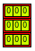
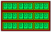
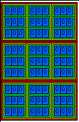
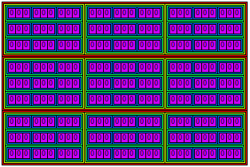

# nD TicTacToe
A n-dimensional implementation of classical TicTacToe.

### examples:
2D

3D

4D

5D

currenttly still under development.
planned features that are not implementet yet are:
* enterin a number (1=x; 2=o; etc.) for a specific position in the TicTacToe field
* updating the TicTacToe field
* finding lines with the same characters inside them

features already added:
* visualization for nd TicTacToe fields
* n-dimensional TicTacToe field generation (very compact and stable algorithm)
